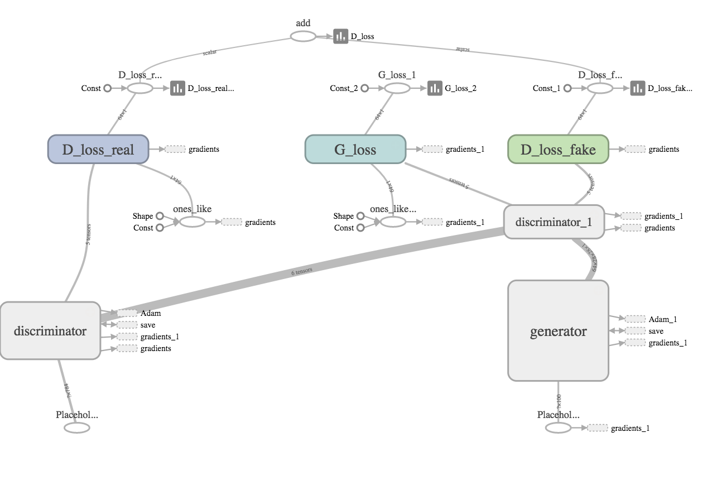
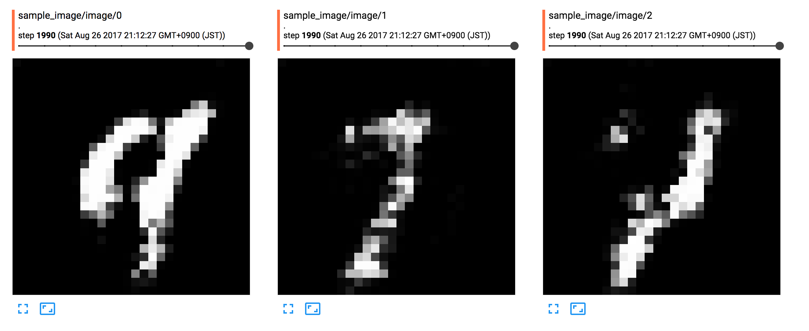

TensorFlow-DCGAN
==============================

DCGAN(Deep Convolutional Generative Adversarial Network) implementation in TensorFlow



# How to run

```
$ make run
```

Options which can be specified are here.

```
$ make run OPTIONS='--help'
python src/models/train_model.py --help
usage: train_model.py [-h] [--height HEIGHT] [--width WIDTH] [--epoch EPOCH]

optional arguments:
  -h, --help       show this help message and exit
  --height HEIGHT  Input image height. Default is MNIST dataset
  --width WIDTH    Input image width. Default is MNIST data set
  --epoch EPOCH    The number of training iteration
```

Metrics and generated sample images are stored as Tensorflow summary in `models` directory. You can check the loss
function value and generated image by Tensorboard.

```
$ tensorboard --logdir models
```

This is a sample image from MNIST dataset in 2000 epoch.



# Reference

* [*Unsupervised Representation Learning with Deep Convolutional Generative Adversarial Networks*](https://arxiv.org/abs/1511.06434), Alec Radford, Luke Metz, Soumith Chintala
* [carpedm20/DCGAN-tensorflow](https://github.com/carpedm20/DCGAN-tensorflow)
